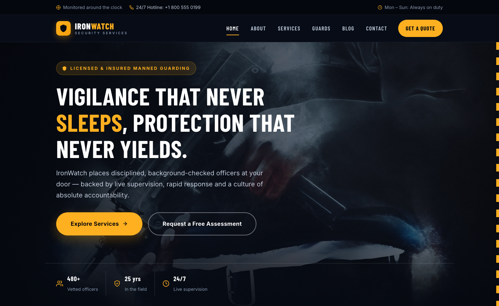

# IronWatch Security — Premium Security Services Template

A premium, framework-free HTML template for a professional security guard and manned guarding services company. Dark navy backdrop with high-vis amber accents, driven by Barlow Condensed display type and Inter body text — a commanding, trustworthy presence for a security firm protecting assets across 150+ client sites.

## 📸 Screenshot

## Design System

| Token | Value |
|-------|-------|
| **Ground** | `#fff` (light), `--ink-50` `#f8fafc` (section), `--ink-900` `#0A1428` (dark navy) |
| **Primary** | `--amber-500` `#F59E0B` (high-vis amber), `--amber-600` `#D97706` |
| **Secondary** | `--navy-700` `#1E2A45` (navy mid), `--slate-500` `#64748B` |
| **Text** | `--ink-800` `#1E293B`, `--ink-600` `#475569`, `--ink-400` `#94A3B8` |
| **Display type** | `Barlow Condensed` (sans, 600–700) |
| **Body type** | `Inter` (sans, 400–700) |
| **Container** | 1200px max-width, centered |
| **Breakpoints** | ~1024px (grid collapse), ~768px (mobile nav) |

## Pages

| Page | File | Description |
|------|------|-------------|
| Home | [index.html](index.html) | Hero with crossfade, feature strip, about preview, stats, services, testimonials, blog preview, CTA |
| About | [about.html](about.html) | Company story, leadership philosophy, stats band, why-choose-us tiles |
| Services | [service.html](service.html) | Six service cards, process strip, stats |
| Guards | [guard.html](guard.html) | Officer profiles (4-person leadership team), standards, stats |
| Blog | [blog.html](blog.html) | Blog grid with 6 articles, pagination, category tags |
| Article | [single.html](single.html) | Full article layout with sidebar, recent posts, CTA widget |
| Contact | [contact.html](contact.html) | Contact cards, enquiry form with `[data-form]` validation, coverage map |

## Features

- **Framework-free** — pure HTML5, CSS3 (custom properties, Grid, Flexbox, `clamp()`), vanilla JavaScript
- **Security-first aesthetic** — dark navy grounds, high-vis amber accents, authoritative typography
- **Fluid responsive** — three breakpoints, no horizontal scroll on any viewport
- **Scroll reveal** — IntersectionObserver-powered `.reveal` animations (respects `prefers-reduced-motion`)
- **Mobile nav** — burger toggle with `aria-expanded` accessible pattern
- **Hero crossfade** — automatic 6s image transition via `.hero-bg img` + `.active` class
- **Inline SVG icons** — all UI icons are custom SVGs, no icon library dependency
- **Form validation** — `[data-form]` hook with `.form-ok` / `.form-err` / `.show` toggle
- **Original imagery** — production-quality security and surveillance photography, no placeholders

## Tech Stack

- HTML5 + CSS3 (W3C-valid, semantic landmarks)
- Vanilla JavaScript (canonical IIFE build)
- Google Fonts (Barlow Condensed + Inter)
- SVG favicon (inline data: URI)

## SEO

- Semantic HTML5 structure (`<header>`, `<nav>`, `<main>`, `<section>`, `<footer>`)
- Unique `<title>` and `<meta description>` per page
- `lang="en"` attribute, `charset="utf-8"`, viewport meta
- Alt text on all images

## License

Free for personal and commercial use. Attribution appreciated but not required.

---

## Let's Build Something Together 🚀

[Book a free consultation](https://tally.so/r/q4q1L9)